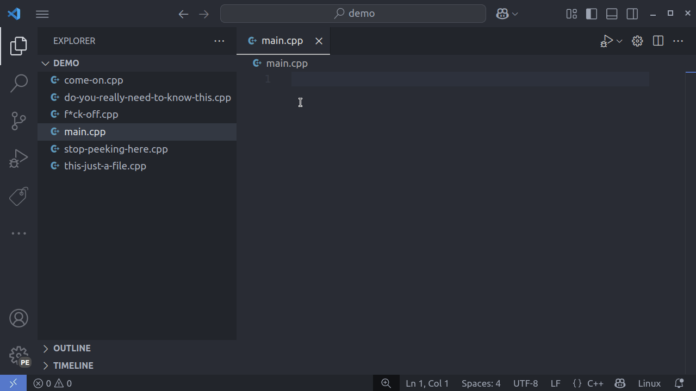
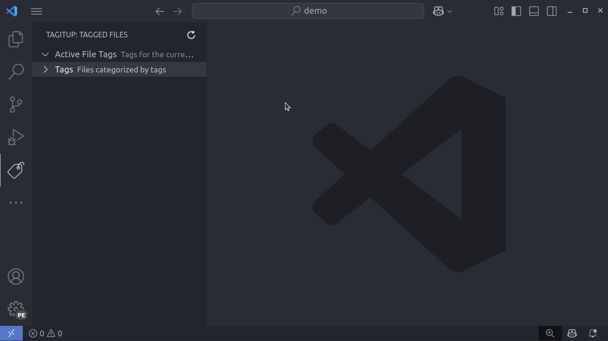

# TagitUp

A simple VS Code extension for tagging files within your workspace and easily searching for them. Keep your files organized by assigning relevant tags to your files.
I did this mainly to tag leetcode problems so that I can categorize them and come back to them based on the topics that are associated with the problem.

For example:
[Apply Operations to maximize the score](https://leetcode.com/problems/apply-operations-to-maximize-score/description/)
this S.O.B. problem has:
1. Binomial Exponentiation (modular actually)
2. Sieve
3. Monotonic Stack

So, tag them. It will be useful later on.

Note: There are a bunch of features that I can do further. Will do when time permits.

## Features

*   **Tag Files:** Assign one or more tags to the currently open file.
*   **View Tags:**
    *   See tags for the active file directly in the "TagitUp" view (An exclusive activity bar view, cause why not?).
    *   Browse all unique tags used in the workspace (in the current workspace only).
    *   List all files associated with a specific tag.
*   **Search:** Find files using tag expressions (& - AND, | - OR, () - grouping. See, dummy, you can't use commas here).
*   **Persistence:** Tags are saved within your VS Code workspace state, persisting across sessions for that workspace (NBD, everything is handled by VS Code).
*   **File Management:** Automatically handles tag migration on file rename and cleanup on file deletion (within VS Code. Outside VS Code, you can hit refresh.).

## Usage

1.  **Open the TagitUp View:** Click on the TagitUp icon in the Activity Bar (you may need to add it if it's hidden).

2.  **TagitUp View Sections:**
    *   **Active File Tags:** Displays tags associated with the currently focused file. Click the `(x)` icon next to a tag to remove it from the file.
    *   **Tags:** Lists all unique tags found in the workspace. Expand a tag to see all files associated with it. Click on a file name to open it.

3.  **Commands (Access via Command Palette: Ctrl+Shift+P or Cmd+Shift+P):**
    *   **`TagitUp: Add/Edit Tags for Current File`**:
        *   Prompts you to enter comma-separated tags for the currently active file pre-filled with the existing tags of that file, if any.
        *   **Tag Rules:** Tags cannot contain spaces. `#` is an optional convention (e.g., `#heap`, `graph`, `linked_list` are all valid).
        *   Use `#` though, it looks good. 

    *   **`TagitUp: Search Files by Tags`**:
        *   Prompts you to enter a tag query.
        *   **Syntax:**
            *   `#tag1` (find files with #tag1)
            *   `#tag1 & #tag2` (find files with both #tag1 AND #tag2)
            *   `#tag1 | #tag2` (find files with either #tag1 OR #tag2)
            *   `(#tag1 & #tag2) | #tag3` (grouping with parentheses)
        *   Select a file from the results to open it.
    *   **`TagitUp: Refresh View`**: Manually refreshes the TagitUp view contents.
    *   **`TagitUp: Clear All Tags`**: Removes *all* tags from *all* files in the workspace state (requires confirmation). Use with caution!

## Contributing

Contributions, issues, and feature requests are welcome! Please check the [repository issue tracker](https://github.com/Udayk02/TagitUp/issues).

## License

[MIT](https://github.com/Udayk02/TagitUp/blob/master/LICENSE)